```{r setup, include=FALSE}
options(htmltools.dir.version = FALSE)
knitr::opts_chunk$set(echo = TRUE, fig.align = "center", fig.height = 4, 
                      cache = FALSE, warning = FALSE)
```


# Overview

#### AM

- Intro to the Tidyverse

- Importing and wrangling data with `readr` and `tidyr`.

- Exploration and visualization with `ggplot2` and `dplyr`.

#### Lunch

#### PM

- Intro to `RMarkdown`.

- Building interactive reports with `Shiny`.

---
## Intro to the Tidyverse

### Tidy Analysis Pipeline

```{r, echo = FALSE, fig.align='center'}
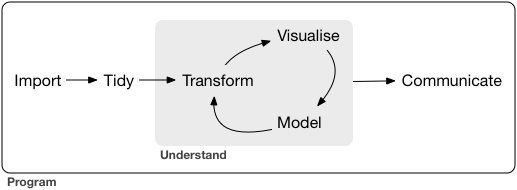
```

* *tidyverse* philosophy: collection of small, simple functions that each do one thing well

* Written by Hadley Wickham, Chief Scientist for R Studio, who also developed:

    + <code>ggplot2</code>
    + <code>reshape2</code>
    + <code>tidyr </code>
    + many others

---

## Intro to the Tidyverse

### Tidy Data

```{r, echo = FALSE, fig.align='center'}
knitr::include_graphics('Figures/tidy_data.png')
```

---
## Intro to the Tidyverse

### Book: R for Data Science

```{r, echo = FALSE, fig.align='center', out.height="275px", out.width="175px", fig.asp=TRUE}
knitr::include_graphics('Figures/r4ds.png')
```

<http://r4ds.had.co.nz/>

---
## Intro to the Tidyverse

### Packages

__readr__: import and export data

__tidyr__: wrangle and clean data

__dplyr__: slice, subset, transform, and summarize data

__ggplot2__: visualization

__RMarkdown__: preparing and presenting results

__Shiny:__ making interactive analyses

---

--- 
## Intro to Tidyverse: Getting Started

### Install Packages

```{r, eval = FALSE}
install.packages("tidyverse")
install.packages("rmarkdown")
install.packages("shiny")
```

---
## Load Tidyverse

```{r}
library(tidyverse)
```

---
## Load IMDB Data

```{r}
imdb <- read_csv("movie_metadata.csv")
imdb <- unique(imdb)
nrow(imdb)
```

---
## IMDB Data

```{r}
head(imdb)
```

---
## IMDB Data

```{r}
colnames(imdb)
```

---
## Visualization with `ggplot2`

- `ggplot2` is a plotting package that is a nice and more modern alternative to 
`R` base plots

- Based on the idea of a _grammar of graphics_...

  - Think of a __plot like a sentence...__
  
  - __noun__: the plot data
  
  - __verbs__: the plot types
  
  - __adverbs__: the plot characteristics

---
class: center, middle, inverse
## Visualization with `ggplot2`

---
## Visualization with `ggplot2`

```{r, echo = FALSE, fig.align='center'}
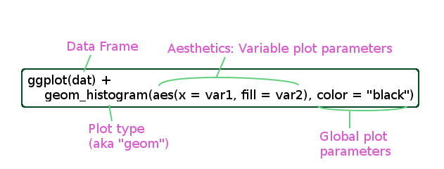
```

---
## Visualization with `ggplot2`

### List of `geom`s

- `geom_histogram`

- `geom_density`

- `geom_point`

- `geom_line`

- `geom_boxplot`

- ... many others

---
## Visualization with `ggplot2`

```{r}
library(ggplot2)
```

```{r}
ggplot(imdb) + 
  geom_histogram(aes(x = imdb_score))
```

---
## Visualization with `ggplot2`

#### Some Aesthetics

_x_: horizontal position

_y_: vertical position

_alpha_: transparency

_color_: border color

_fill_: interior color

_group_: grouping variable

_linetype_

_size_

---
## Visualization with `ggplot2`

#### Different geoms have different aesthetics

#### Refer to the documentation to see which aesthetics are supported for a geom

```{r}
?geom_histogram
```

---
## Visualization with `ggplot2`

```{r}
imdb$recent <- imdb$title_year > 2000
ggplot(imdb) + 
  geom_histogram(aes(x = imdb_score, fill = recent))
```

---
## Visualization with `ggplot2`

```{r}
imdb$recent <- imdb$title_year > 2000
ggplot(imdb) + 
  geom_histogram(aes(x = imdb_score, fill = recent), 
                 color = "black", bins = 30)
```

---
## Visualization with `ggplot2`

```{r}
ggplot(imdb) + 
  geom_histogram(aes(x = imdb_score, fill = recent), 
                 color = "black", bins = 30) + 
  xlab("IMDB Score") + 
  ylab("Count") + 
  ggtitle("Comparing IMDB Scores for Recent vs Old Movies")
```

---
## Visualization with `ggplot2`

```{r}
ggplot(imdb) + 
  geom_histogram(aes(x = imdb_score, fill = recent), 
                 color = "black", bins = 30, alpha = 0.4) + 
  xlab("IMDB Score") + 
  ylab("Count") + 
  ggtitle("Comparing IMDB Scores for Recent vs Old Movies")
```

---
## Visualization with `ggplot2`

```{r}
ggplot(imdb) + 
  geom_density(aes(x = imdb_score, fill = recent), 
               color = "black", alpha = 0.4) + 
  xlab("IMDB Score") + 
  ylab("Density") + 
  ggtitle("Comparing IMDB Scores for Recent vs Old Movies")
```

---
## Visualization with `ggplot2`

```{r}
ggplot(imdb) + 
  geom_point(aes(x = budget, y = imdb_score))
```

---
## Visualization with `ggplot2`

```{r}
ggplot(imdb) + 
  geom_point(aes(x = log(budget), y = imdb_score))
```

---
## Visualization with `ggplot2`

```{r}
ggplot(imdb) + 
  geom_point(aes(x = log(budget), y = imdb_score), color = "green4")
```

---
## Visualization with `ggplot2`

```{r}
ggplot(imdb) + 
  geom_point(aes(x = log(budget), y = imdb_score), 
             pch = 21, fill = "green4", 
             color = "black", alpha = 0.8)
```

---
## Visualization Exercises

1. Plot a histogram of `budget` and compare it to a histogram of `log(budget)`.

2. Add some color, change the title and axis labels for the `log(budget)` histogram.

3. Make a new variable `recent` to indicate if a movie is more recent than 2000 
using `imdb$recent <- imdb$title_year > 2000`, then plot a histogram of `log(budget)` grouped by `recent`. 

4. Create a scatterplot of `imdb_score` by `log(budget)` and colored by `recent`.

5. Create a boxplot of `imdb_score` grouped by `recent`, using `geom_boxplot`.

---
## Visualization Exercise \# 1

```{r}
ggplot(imdb) + 
  geom_histogram(aes(x = budget))
```


---
## Visualization Exercise \# 1

```{r}
ggplot(imdb) + 
  geom_histogram(aes(x = log(budget)))
```

---
## Visualization Exercise \# 2

```{r}
ggplot(imdb) + 
  geom_histogram(aes(x = log(budget)), 
                 color = "orange", fill = "purple", bins = 30) + 
  ggtitle("Exercise 2") + 
  xlab("The Log of the Budget") + 
  ylab("Frequency Count")
```

---
## Visualization Exercise \# 3

```{r}
imdb$recent <- imdb$title_year > 2000
ggplot(imdb) + 
  geom_histogram(aes(x = log(budget), fill = recent), 
                 color = "black")
```

---
## Visualization Exercise \# 4

```{r}
ggplot(imdb) + 
  geom_point(aes(x = log(budget), y = imdb_score, fill = recent), 
             pch = 21, color = "black")
```


---
## Visualization Exercises \# 5

```{r}
ggplot(imdb) + 
  geom_boxplot(aes(y = imdb_score, x = recent, fill = recent))
```

---

```{r}
ggplot(imdb) + 
  geom_point(aes(x = log(budget), y = imdb_score, fill = recent), 
             pch = 21, color = "black") +
  geom_smooth(aes(x = log(budget), y = imdb_score, color = recent), 
              method = "lm")
```

---
## Visualization with `ggplot2`

```{r}
ggplot(imdb[imdb$recent, ]) +
  geom_boxplot(aes(y = imdb_score, fill = factor(title_year), 
                   x = factor(title_year)))
```

---
class: center, middle, inverse
# Data Wrangling with <code>dplyr</code>

---
## Data Wrangling with <code>dplyr</code>

* <code>dplyr</code> is a package designed for easy and efficient data manipulation

### Key Functions

* <code> filter</code>: select subset of rows (observations)

* <code> select</code>: select subset of columns (variables)

* <code> mutate</code>: transform variables in a data set

* <code> arrange</code>: reorder rows

* <code> summarise</code>: collapses a data frame into a single row

* <code>group_by</code>

---
## Data Wrangling with <code>dplyr</code>

* Let's try some <code>dplyr</code> functions with the <code>iris</code> data set:

```{r}
# Print species means of Sepal Width
data(iris)
iris <-  filter(iris, Species!="setosa")
iris <- select(iris, c(Sepal.Width, Species)) 
iris <- group_by(iris, Species)
species_means <- summarise(iris, mean(Sepal.Width))
print(species_means)
```

---
## Data Wrangling with <code>dplyr</code>

### Introducing the Pipe: <code>%>%</code>

* <code>dplyr</code> (and much of the *tidyverse*) is designed around the use of 
the pipe operator <code>%>%</code>

* The pipe operator <code>%>%</code> allows you to chain operations on a data set together 
without having to create specific intermediate objects

* When using <code>%>%</code>, the first argument to a function is taken as the output of the previous step in the chain

---
## Data Wrangling with <code>dplyr</code>

* For example, the following is equivalent to the previous code:

```{r}
# Prints species means, does not save anything
# Original data.frame iris is unaffected
data(iris)
iris %>% filter(Species!="setosa") %>%
    select(c(Sepal.Width, Species)) %>% 
    group_by(Species) %>%
    summarise(mean(Sepal.Width))
```

---
## Data Wrangling with <code>dplyr</code>

```{r}
# To save the results instead
species_means <- iris %>% 
    filter(Species!="setosa") %>%
    select(c(Sepal.Width, Species)) %>% 
    group_by(Species) %>%
    summarise(mean(Sepal.Width))
```

```{r}
species_means
```

---
## <code>dplyr</code> Exercises

1. Use <code>dplyr</code> to calculate the mean Sepal Width of the virginica species.

2. <code>summarise</code> can summarise multiple variables simultaneously, applying a (possibly different) 
function to each variable.  
Adapt the code below to find the minimum, median, 
maximum, and standard deviation of the Sepal.Width for the virginica species.

3. <code>group_by()</code> makes <code>summarise</code> even more useful by allowing you 
to summarise values across groups of a category simultaneously.  
Using <code>group_by</code>, adapt your code from the previous problem to produce the summary values for each species.

**Modify this code for problems 2 and 3:**
```{r, eval=FALSE}
data(iris)
iris %>% summarise(mean_sepal_width = mean(Sepal.Width),
                   min_sepal_width = min(Sepal.Width))
```

---
## <code>dplyr</code> Exercises
*Solution*
* (1) Use <code>dplyr</code> to calculate the mean Sepal Width of the virginica species.

```{r}
data(iris)

iris %>% 
    filter(Species == "virginica") %>%
    summarise(mean_sepal_width = mean(Sepal.Width))
```

---
## <code>dplyr</code> Exercises
*Solution*

* (2) <code>summarise</code> can summarise multiple variables simultaneously, applying a (possibly different) 
function to each variable.  
Adapt the code below to find the minimum, median, 
maximum, and standard deviation of the Sepal.Width for the virginica species.

```{r}
data(iris)
iris %>% 
    filter(Species == "virginica") %>%
    summarise(min_sepal_width = min(Sepal.Width),
              med = median(Sepal.Width), maximum = max(Sepal.Width),
              stdev = sd(Sepal.Width))
```

---
## <code>dplyr</code> Exercises
*Solution*

* (3) <code>group_by()</code> makes <code>summarise</code> even more useful by allowing you 
to summarise values across groups of a category simultaneously.  
Using <code>group_by</code>, adapt your code from the previous problem to produce the summary values for each species.


```{r}
data(iris)
iris %>% 
    group_by(Species) %>%
    summarise(min_sepal_width = min(Sepal.Width),
              med = median(Sepal.Width), maximum = max(Sepal.Width),
              stdev = sd(Sepal.Width))
```

---
# Back to the Movies

---
## Exploring the IMDB Data

#### How many movies for each actor in the dataset?

```{r, eval = FALSE}
imdb %>% 
  group_by(actor_1_name) %>% 
  summarize(n())
```

---
count: false
## Exploring the IMDB Data

#### How many movies for each actor in the dataset?

```{r}
imdb %>% 
  group_by(actor_1_name) %>% 
  summarize(n())
```

---
## Exploring the IMDB Data

#### How many movies for each actor in the dataset?
#### Arranged by decreasing number of movies


```{r}
imdb %>% 
  group_by(actor_1_name) %>% 
  summarize(n_movies = n()) %>% 
  arrange(desc(n_movies))
```

---
## Exploring the IMDB Data

#### How many movies for each actor in the dataset?
#### Arranged by decreasing mean IMDB score

```{r}
imdb %>% 
  group_by(actor_1_name) %>% 
  summarize(mean_imdb_score = mean(imdb_score)) %>% 
  arrange(desc(mean_imdb_score))
```

---
## Exploring the IMDB Data

#### Considering actors with more than 5 movies, list top 10 actors with highest mean IMDB scores in decreasing order.

```{r}
imdb %>% 
  group_by(actor_1_name) %>% 
  summarize(mean_imdb_score = mean(imdb_score), n_movies = n()) %>% 
  filter(n_movies > 5) %>% 
  top_n(10, mean_imdb_score) %>% 
  arrange(desc(mean_imdb_score))
```

---
## Exploring the IMDB Data

#### How many movie entries does Harrison Ford have?

```{r}
actor <- "Harrison Ford"
filter(imdb, actor_1_name == actor) %>% nrow
```

```{r, echo = FALSE, fig.align='center'}
knitr::include_graphics('Figures/indy1.gif')
```

---
class: inverse
background-image: url(Figures/Hansoloprofile.jpg)
background-size: contain

## Exploring the IMDB Data

#### Harrison Ford IMDB Scores

```{r}
imdb %>% 
  filter(actor_1_name == actor) %>% 
  select(imdb_score)
```

---
## Exploring the IMDB Data

#### Histogram of Harrison Ford IMDB Scores

```{r}
ggplot(imdb %>% filter(actor_1_name == actor)) + 
  geom_histogram(aes(x = imdb_score), 
                 fill = "darkred", color = "black", bins = 15)
```

---
## Exploring the IMDB Data

#### Harrison By Genre

```{r}
imdb %>% 
  filter(actor_1_name %in% actor) %>% 
  group_by(genres) %>% 
  summarize(mean_score = mean(imdb_score), n_movies = n())
```

---
## Exploring the IMDB Data

#### Harrison's Action Movies

```{r}
imdb %>% 
  filter(actor_1_name %in% actor) %>% 
  transmute(action = str_detect(genres, "Action"))
```

---
## Exploring the IMDB Data

#### Harrison's Action Movies

```{r}
imdb %>%
  filter(actor_1_name %in% actor) %>% 
  mutate(action = str_detect(genres, "Action")) %>% 
  group_by(action) %>% 
  summarize(mean(imdb_score))
```


---

## Exercises: Exploring the IMDB Data

### Liam vs Harrison

- (1) Plot a histogram of Liam Neeson's IMDB scores

- (2) Create side-by-side boxplots of Harrison's and Liam's IMDB scores.  Overlay the specific points on top of the boxplots with `geom_point`.

- (3) Find the median gross earned for Harrison movies and Liam movies.

- (4) Create a scatterplot of IMDB scores by `log(gross)` for just Harrison and Liam, and color the points according to the actor.

- (5) Do Harrison's action movies or Liam's drama movies have larger median gross?

---
## Liam vs Harrison

(1) Plot a histogram of Harrison Ford's IMDB scores

```{r}
ggplot(imdb %>% filter(actor_1_name == "Harrison Ford")) + 
  geom_histogram(aes(x = imdb_score), fill = "green4", color = "black")
```

---
## Liam vs Harrison

(2) Create side-by-side boxplots of Liam's and Harrison's IMDB scores.  Overlay the specific points on top of the boxplots with `geom_point`.

```{r}
ggplot(imdb %>% filter(actor_1_name %in% c("Liam Neeson", "Harrison Ford"))) + 
  geom_boxplot(aes(y = imdb_score, x = actor_1_name, fill = actor_1_name), 
               color = "black") + 
  geom_point(aes(x = actor_1_name, y = imdb_score, fill = actor_1_name), 
             color = "black", pch = 21)
```

---
## Liam vs Harrison

(3) Find the median gross earned for both actors.

```{r}
imdb %>% filter(actor_1_name %in% c("Liam Neeson", "Harrison Ford")) %>% 
  group_by(actor_1_name) %>% 
  summarize(median_gross = median(gross, na.rm = TRUE))
```

---
## Liam vs Harrison

(4) Create a scatterplot of IMDB scores by `log(gross)` for just Harrison and Liam, and color the points according to the actor.

```{r}
imdb_HL <- imdb %>% filter(actor_1_name %in% c("Liam Neeson", "Harrison Ford"))
ggplot(imdb_HL) + 
  geom_point(aes(x = log(gross), y = imdb_score, fill = actor_1_name), 
             color = "black", pch = 21)
```


---
## Liam vs Harrison

(5) Do Harrison's action movies or Liam's drama movies have larger median gross?

```{r}
imdb %>%
  filter(actor_1_name %in% "Harrison Ford") %>% 
  mutate(action = str_detect(genres, "Action")) %>% 
  group_by(actor_1_name, action) %>% 
  summarize(mean(imdb_score)) %>% 
  filter(action == TRUE)
```

```{r}
imdb %>%
  filter(actor_1_name == "Liam Neeson") %>% 
  mutate(drama = str_detect(genres, "Drama")) %>% 
  group_by(actor_1_name, drama) %>% 
  summarize(mean(imdb_score)) %>% 
  filter(drama == TRUE)
```

---
class: center, middle, inverse
# Intro to RMarkdown

---
# Needed Packages

- `shiny`

- `flexdashboard`

- `plotly`

- `stargazer`

## Optional Packages

- `biclust`

- `xaringan`


---

# Intro to R Markdown

* __R Markdown__ is an implementation of the _Markdown_ markup language 

* Markdown is a versatile tool that makes it easy to make readable scientific documents in a variety of formats

* R markdown is actively developed and supported by the RStudio team, which means:

  + RStudio has many tools and features to make R Markdown flexible and easy to use

  + New R Markdown features and packages are frequently released
  
---

# Intro to R Markdown

* __R For Data Science__ on the intent of R Markdown:

_R Markdown files are designed to be used in three ways:_

1. _For communicating to decision makers, who want to focus on the conclusions, not the code behind the analysis._

2. _For collaborating with other data scientists (including future you!), who are interested in both your conclusions, and how you reached them (i.e. the code)._

3. _As an environment in which to do data science, as a modern day lab notebook where you can capture not only what you did, but also what you were thinking._

---

# Getting Started with R Markdown

* R Markdown files end in `.Rmd`

* Create a new R markdown document in RStudio:

  + `File > New File > R Markdown...`
  
.center[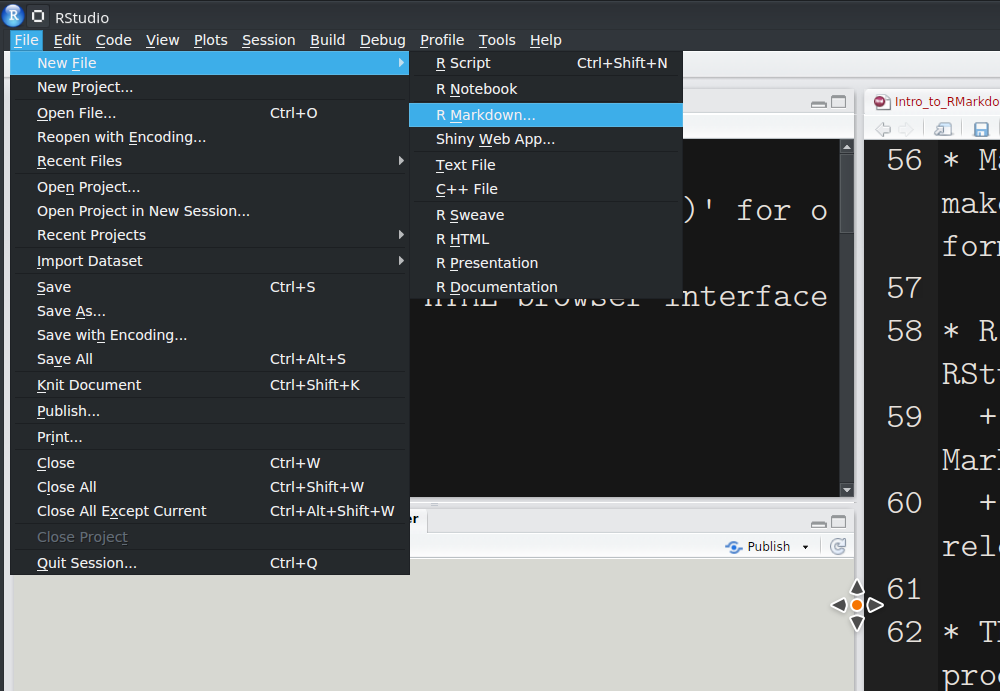]
  
---

# Getting Started with R Markdown

.center[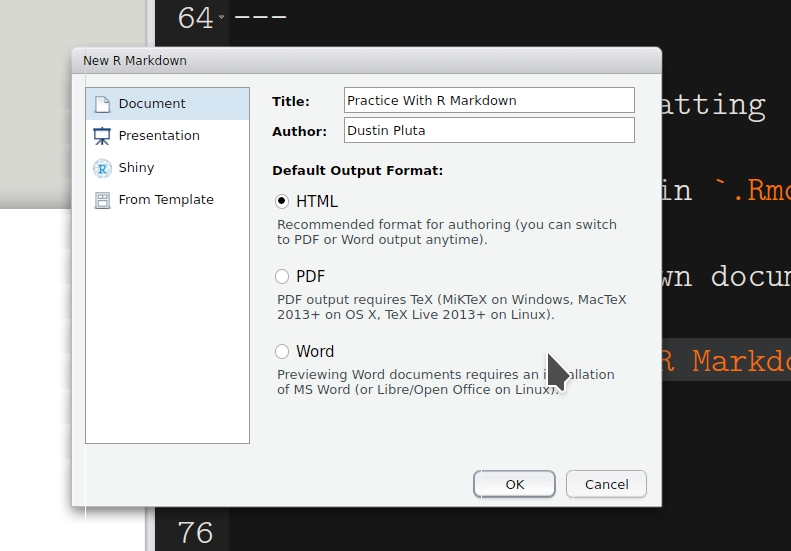]

  
---

# Getting Started with R Markdown

* The default R Markdown template gives some examples of basic R Markdown features

.center[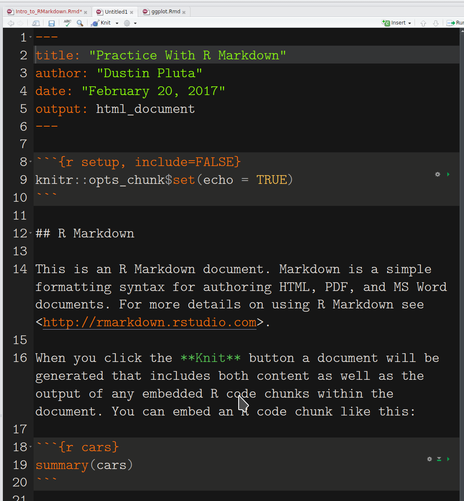]


---

# Getting Started with R Markdown

.center[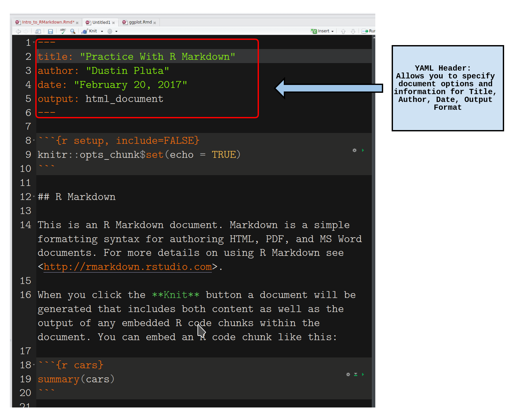]


---

# Getting Started with R Markdown

.center[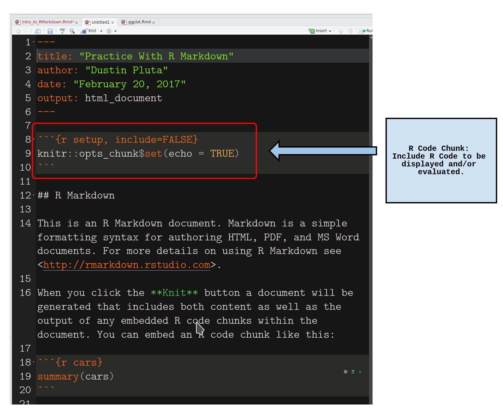]


---

# Getting Started with R Markdown

.center[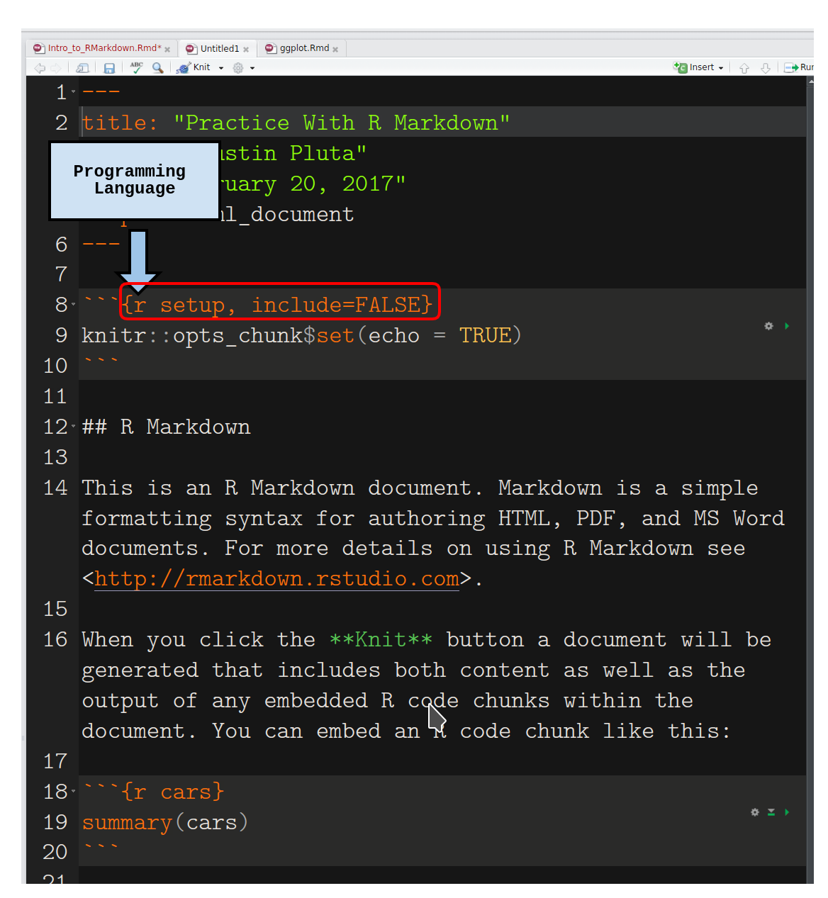]


---

# Getting Started with R Markdown

.center[]


---

# Getting Started with R Markdown

.center[]


---

# Getting Started with R Markdown

.center[]


---

# Getting Started with R Markdown

.center[]


---

# Getting Started with R Markdown

* Compile or "knit" the R Markdown document to the desired format (either html, pdf, or Word document)

.center[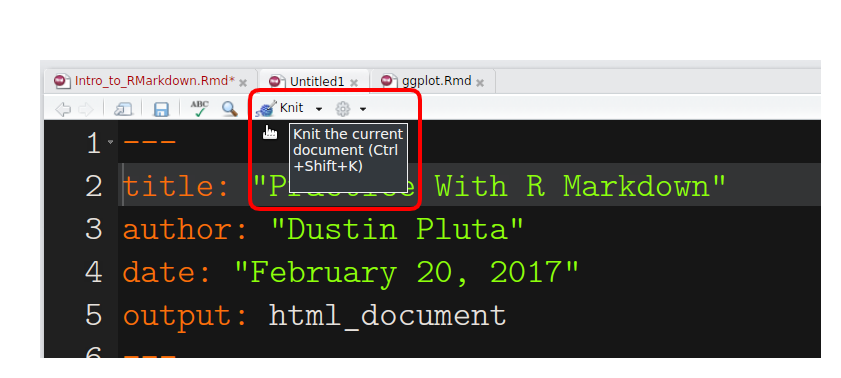]


---

# Getting Started with R Markdown

.center[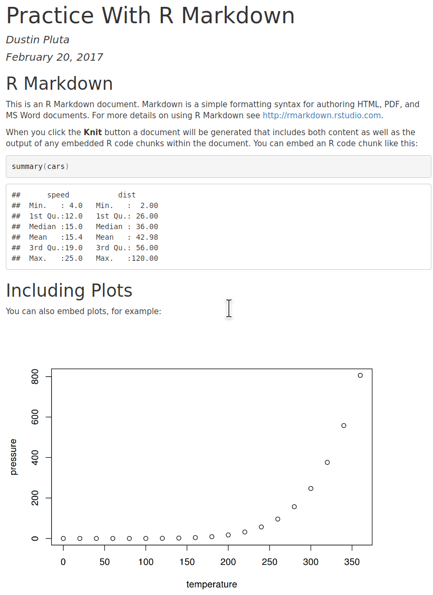]

---

# Getting Started with R Markdown

* Let's modify the plot to include a title, and make the points blue.

.center[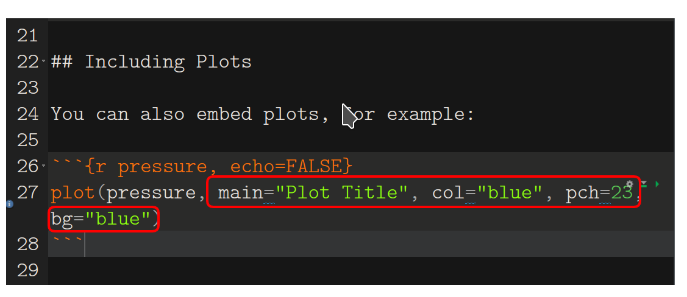]


---

# Getting Started with R Markdown

```{r pressure}
plot(pressure, main = "Plot Title", pch = 23, col = "blue", bg = "blue")
```

---

# Practice With R Markdown


[R Markdown Cheat Sheet](https://www.rstudio.com/wp-content/uploads/2015/02/rmarkdown-cheatsheet.pdf)

1. R Markdown Basic Example: Shows simple plot with `cars` data set.

2. R Markdown Exercise Set 1: More examples and some exercises to try on the Iris and IMDB data sets.

---

# More R Markdown Features

1. Presentations: beamer, ioslides, slidy, xaringan

2. knitr

3. Blogdown

4. Bookdown

5. Interactive Documents 


---

# Presentations

- You can easily create academic presentations using 4 different formats

    + beamer (pdf)
    
    + ioslides (html)
    
    + slidy (html)
    
    + xaringan (html)
    
.center[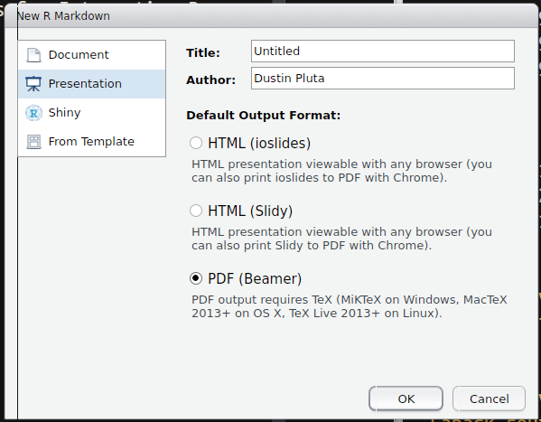]


---

# knitr

- R Markdown can make full use of Latex through the `knitr` package

- `knitr` lets you easily display mathematical formulas and other Latex formatting in your Markdown document

- For example, math can be inserted inline like $\alpha^2 + \beta^2 = \gamma^2$ or in display mode:

$$Y = X \beta + \varepsilon$$

$$\int_{\mathbb{R}} \sum_{i = 1}^n \nabla \ell_i d\mu$$

---

# Blogdown

[Making a Website Using Blogdown, Hugo, and GitHub pages](https://proquestionasker.github.io/blog/Making_Site)/

[Example Blogdown Blog: Simply Statistics](https://simplystatistics.org)

---

# Next Steps

- `RMarkdown_Basic_Example.Rmd`
- `Iris_Example.Rmd`
- `RMarkdown_Exercise_Set1.Rmd`
- `Interactive_RMarkdown_Example.Rmd`
- `RMarkdown_Exercise_Set2.RMD`
- `IMDB_Dashboard.Rmd`

---

# Some Resources for R

* [<code>dplyr</code> and Data Wrangling Cheat Sheet](https://www.rstudio.com/wp-content/uploads/2015/02/data-wrangling-cheatsheet.pdf)

* [R Markdown Cheat Sheet](https://www.rstudio.com/wp-content/uploads/2015/02/rmarkdown-cheatsheet.pdf)

* [Data Carpentry Lessons for R](http://www.datacarpentry.org/R-ecology-lesson/)

* [<code>dplyr</code> Tutorial](http://genomicsclass.github.io/book/pages/dplyr_tutorial.html)

* [Advanced R](http://adv-r.had.co.nz/)

* [R for Data Science](http://r4ds.had.co.nz/)

* [Coursera Data Science Specialization](https://www.coursera.org/specializations/jhu-data-science)


